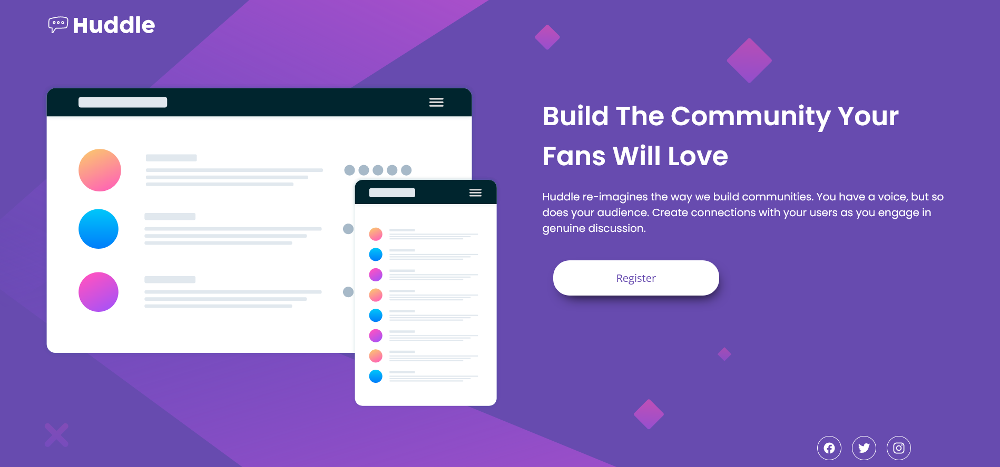
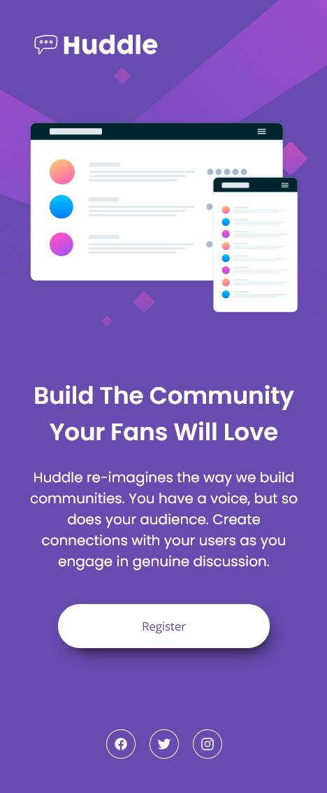

# Frontend Mentor - Huddle landing page with single introductory section solution

This is a solution to the [Huddle landing page with single introductory section challenge on Frontend Mentor](https://www.frontendmentor.io/challenges/huddle-landing-page-with-a-single-introductory-section-B_2Wvxgi0). Frontend Mentor challenges help you improve your coding skills by building realistic projects. 

## Table of contents

- [Overview](#overview)
  - [The challenge](#the-challenge)
  - [Screenshot](#screenshot)
  - [Links](#links)
- [My process](#my-process)
  - [Built with](#built-with)
  - [What I learned](#what-i-learned)
- [Author](#author)

## Overview

### The challenge

Users should be able to:

- View the optimal layout for the page depending on their device's screen size
- See hover states for all interactive elements on the page

### Screenshot

### Links

- Solution URL: [Add solution URL here](https://github.com/stagnant-sys/Frontend-Challenges/tree/main/L1-huddle-landing-page)
- Live Site URL: [Add live site URL here](https://stagnant-sys.github.io/Frontend-Challenges/L1-huddle-landing-page/)

## My process

### Built with

- Semantic HTML5 markup
- CSS custom properties
- Flexbox
- SCSS

### What I learned

This challenge was pretty straightforward, I focused on being as close to the original design as I could.
I learned how to manipulate svg images and practiced SCSS for the first time.

## Author

- GitHub - [stagnant-sys](https://github.com/stagnant-sys)
- Frontend Mentor - [@stagnant-sys](https://www.frontendmentor.io/profile/stagnant-sys)