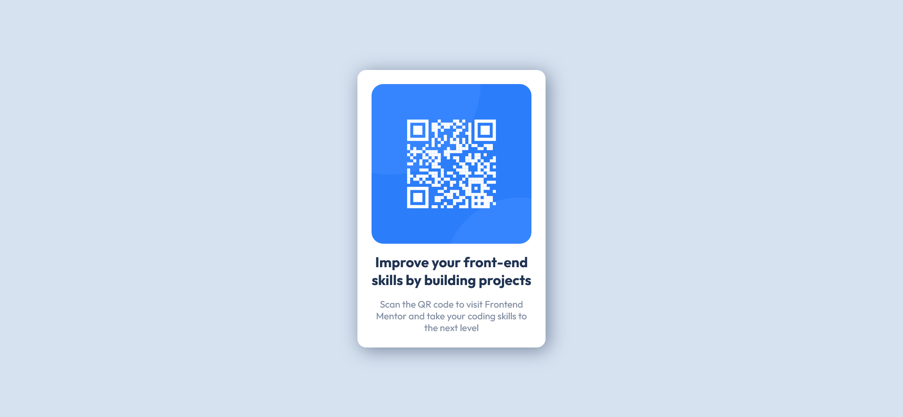

# Frontend Mentor - QR code component solution

This is a solution to the [QR code component challenge on Frontend Mentor](https://www.frontendmentor.io/challenges/qr-code-component-iux_sIO_H). Frontend Mentor challenges help you improve your coding skills by building realistic projects. 

## Table of contents

- [Overview](#overview)
  - [Screenshot](#screenshot)
  - [Links](#links)
- [My process](#my-process)
  - [Built with](#built-with)
  - [What I learned](#what-i-learned)
  - [Continued development](#continued-development)
  - [Useful resources](#useful-resources)
- [Author](#author)
- [Acknowledgments](#acknowledgments)

**Note: Delete this note and update the table of contents based on what sections you keep.**

## Overview

### Screenshot

### Links

[Live Site URL](https://stagnant-sys.github.io/qr-code-component-main/)

## My process

### Built with

- Semantic HTML5 markup
- CSS custom properties
- Flexbox

### What I learned

I didn't learn anything new because it was straigthforward, but it was an good oportunity to work more with Flexbox for the centering of the main card.

### Continued development

I still don't fully understand the "margin: auto;" propriety, I get by with trial and error for now, but I hope to get it right with practice.

### Useful resources

## Author

- Github - [stagnant-sys](https://github.com/stagnant-sys)
- Frontend Mentor - [@stagnant-sys](https://www.frontendmentor.io/profile/stagnant-sys)

## Acknowledgments

Thanks to Frontend Mentor for giving free project ideas to practice what I'm currently learning.